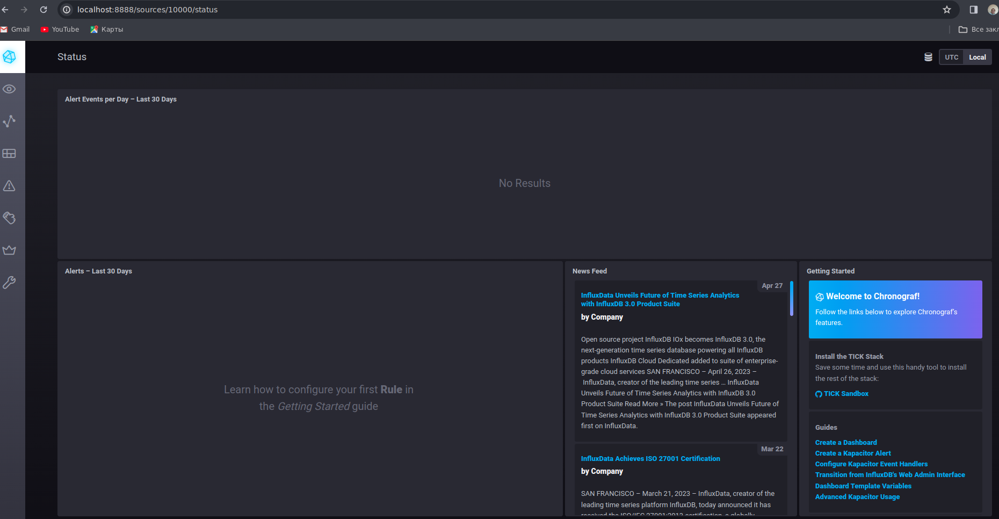
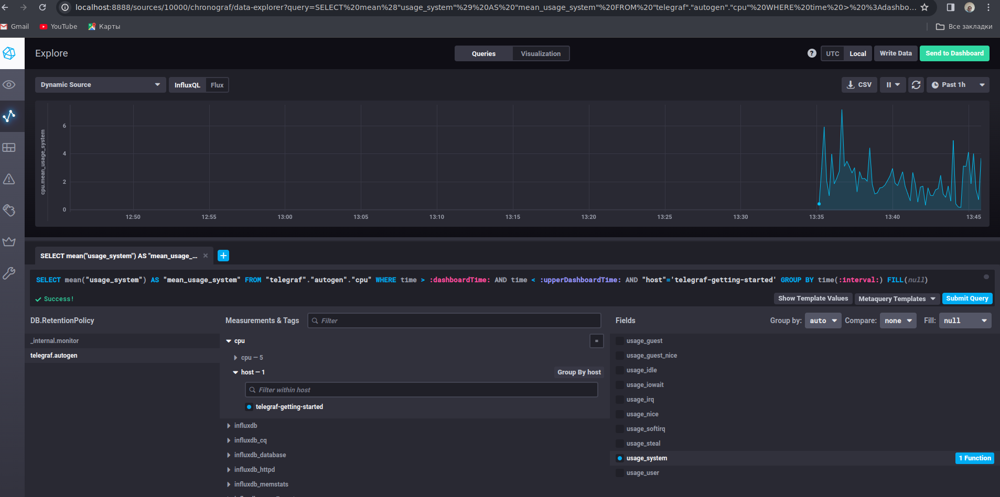
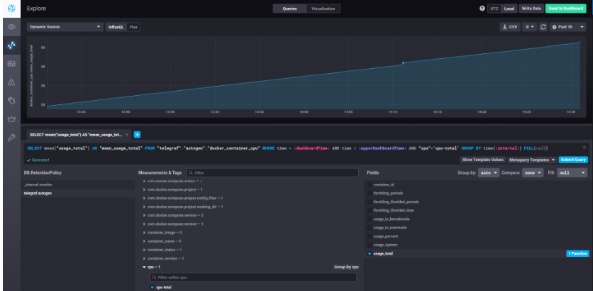

# Домашнее задание к занятию "13.Системы мониторинга"

## Обязательные задания

1. Вас пригласили настроить мониторинг на проект. На онбординге вам рассказали, что проект представляет из себя платформу для вычислений с выдачей текстовых отчётов, которые сохраняются на диск.
   Взаимодействие с платформой осуществляется по протоколу http. Также вам отметили, что вычисления загружают ЦПУ. Какой минимальный набор метрик вы выведите в мониторинг и почему?

```
CPU Load average CPU 1,5,15. Контроль загрузки CPU
Свободное место на диске. Прямая зависимость от работоспособности.
I/O диска. нагрузка на диски. мониторинг состояния работы дисков.
время ответа и время записи на диск
Объем свободной оперативной памяти. наличие свободной памяти напрямую влияет на работоспособность сервера
Мониторинг службы веб-сервера. контроль доступности.
```

2. Менеджер продукта, посмотрев на ваши метрики, сказал, что ему непонятно, что такое RAM/inodes/CPUla. Также он сказал, что хочет понимать, насколько мы выполняем свои обязанности перед клиентами и какое качество обслуживания. Что вы можете ему предложить?

```
Ответ:
CPU - нагруженность(задержки на комманд процесса) процессора (нагрузка на приложение). inodes - загруженность файлово системы (нагрузка ПО на формирование отчетов:кол-во отчетов). RAM - загруженность оперативной памяти.

Предолжу заключить SLA c клиентом,внутри опираться на SLO и SLI,определить Error budget а так же начать учитывать MTBF (Mean Time Between Failures) — среднее время между сбоями и MTTR (Mean Time To Recovery) среднее время восстановления.

```

3. Вашей DevOps-команде в этом году не выделили финансирование на построение системы сбора логов. Разработчики, в свою очередь, хотят видеть все ошибки, которые выдают их приложения. Какое решение вы можете предпринять в этой ситуации, чтобы разработчики получали ошибки приложения?

```
Система сбора логов Elastic Stack
```

4. Вы, как опытный SRE, сделали мониторинг, куда вывели отображения выполнения SLA = 99% по http-кодам ответов.
   Этот параметр вычисляется по формуле: summ_2xx_requests/summ_all_requests. Он не поднимается выше 70%, но при этом в вашей системе нет кодов ответа 5xx и 4xx. Где у вас ошибка?

```
Отсутствие в расчетах сообщений 1хх и 3хх
#

5. Опишите основные плюсы и минусы pull и push систем мониторинга.

```
PUSH - удобна для использования в динамически создаваемых машинах (например из докер-контейнеров), так как в противном случае Система мониторинга должна будет узнавать о новых хостах для их опроса, можно задавать глубину мониторинга именно на машинах, добавление новых иснтансов автоматом добавит метрику без настройки системы мониторинга Передача данных в открытом виде по сети, при наличии ПД в метриках есть риск утечки данных так же есть риск потери данных при недоступности системы мониторинга (принимающей метрики) передаваться данные должны на один ресурс для сбора (одну систему мониторинга) одним источником


PULL - контроль над метриками с единой точки, возможность конеккта по SSL к агентам. более высокий уровень контроля за источниками метрик ,т.е. всегда известно кто откуда что передает, возможность ставить в Downtime (отключение алертинга) целых систем без потери передаваемых данных (хотя думаю в Push так же реализуемо) Ну и то что разными системами мониторинга можно получать одни и теже метрики, можно выподнять запросы метрики с изменяемой переодичностью так же запрашивать метрики в ручном режиме в обход систем сбора минус - неудобство для динамических машин (докер-контейнеры) нужно динамически собирать статистику о наличии машин, нужен дополнительный оркестратор

```

#
6. Какие из ниже перечисленных систем относятся к push модели, а какие к pull? А может есть гибридные?

    - Prometheus 
    - TICK
    - Zabbix
    - VictoriaMetrics
    - Nagios

```
Prometheus PULL : одновременно опрашивает системы, так же может получать данные от агентов exporter-ов, и получать метрики о событиях
TICK PUSH : telegraph передает информацию в систему хранилище, так же данные получает Kapasitor по Pull модели
Zabbix PULL : использует подключение к ресурсом по стандартным протоколам или же оправшивает сови агенты у становленные на серверах для получения данных
VictoriaMetrics БОльше подходит PUSH, так как метрики записываются в нее, но это (если правильно понял по описанию) система для хранения по большей части, и получает данные, которые к нейпишут другие системы
Nagios PULL : Так же использует опрос snmp, агентов, которые собирают информацию
```


#
7. Склонируйте себе [репозиторий](https://github.com/influxdata/sandbox/tree/master) и запустите TICK-стэк, 
используя технологии docker и docker-compose.

В виде решения на это упражнение приведите скриншот веб-интерфейса ПО chronograf (`http://localhost:8888`). 

P.S.: если при запуске некоторые контейнеры будут падать с ошибкой - проставьте им режим `Z`, например
`./data:/var/lib:Z`



#
8. Перейдите в веб-интерфейс Chronograf (http://localhost:8888) и откройте вкладку Data explorer.
        
    - Нажмите на кнопку Add a query
    - Изучите вывод интерфейса и выберите БД telegraf.autogen
    - В `measurments` выберите cpu->host->telegraf-getting-started, а в `fields` выберите usage_system. Внизу появится график утилизации cpu.
    - Вверху вы можете увидеть запрос, аналогичный SQL-синтаксису. Поэкспериментируйте с запросом, попробуйте изменить группировку и интервал наблюдений.

Для выполнения задания приведите скриншот с отображением метрик утилизации cpu из веб-интерфейса.



#
9. Изучите список [telegraf inputs](https://github.com/influxdata/telegraf/tree/master/plugins/inputs). 
Добавьте в конфигурацию telegraf следующий плагин - [docker](https://github.com/influxdata/telegraf/tree/master/plugins/inputs/docker):
```
[[inputs.docker]]
  endpoint = "unix:///var/run/docker.sock"
```

Дополнительно вам может потребоваться донастройка контейнера telegraf в `docker-compose.yml` дополнительного volume и 
режима privileged:
```
  telegraf:
    image: telegraf:1.4.0
    privileged: true
    volumes:
      - ./etc/telegraf.conf:/etc/telegraf/telegraf.conf:Z
      - /var/run/docker.sock:/var/run/docker.sock:Z
    links:
      - influxdb
    ports:
      - "8092:8092/udp"
      - "8094:8094"
      - "8125:8125/udp"
```

После настройке перезапустите telegraf, обновите веб интерфейс и приведите скриншотом список `measurments` в 
веб-интерфейсе базы telegraf.autogen . Там должны появиться метрики, связанные с docker.

Факультативно можете изучить какие метрики собирает telegraf после выполнения данного задания.



